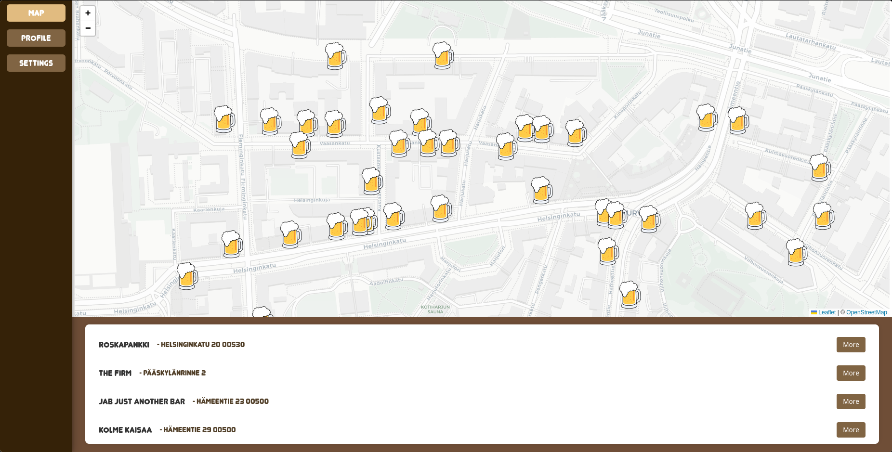

# Student App
This application allows users to review and rate the restroom facilities of bars and pubs. The main goal is to help people quickly find places with clean, well-maintained, and comfortable restrooms when they are out in the city.

In the future, the application may expand beyond restroom reviews to include additional features such as general venue ratings, accessibility information, photos, location-based recommendations, and other useful insights related to nightlife and public spaces.
## Tech
React Javascript, css and supabase at the moment.

## Screeshots and more

